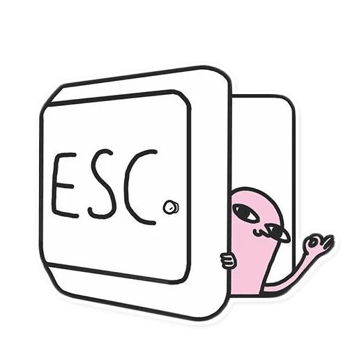

## 👋 &nbsp;Hey there! I'm Mahendra

### 👨🏻‍💻 &nbsp;About Me

🎓 &nbsp;I'm Computer Science graduate from India. 
🌱 &nbsp;I’m currently diving into Web Development, specifically ReactJS and ExpressJS, and I'm also exploring Data Structures, Backend Development, and Databases. 
💬 &nbsp;Feel free to reach out to me for some interesting discussion. 

### 🛠 &nbsp;Tech Stack

  <a href="https://skillicons.dev">
    
     
    
  </a>

### 🤝🏻 &nbsp;Connect with Me

    
    
    

